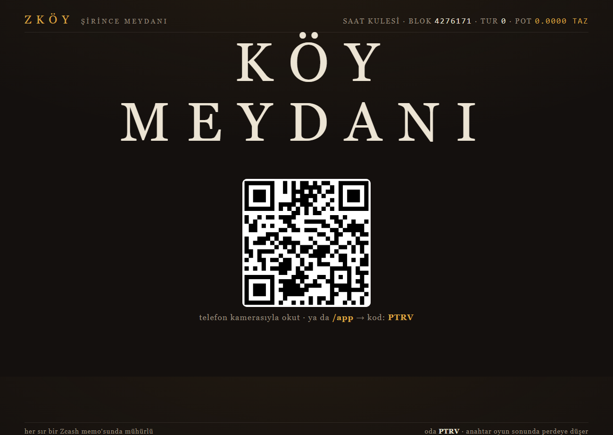
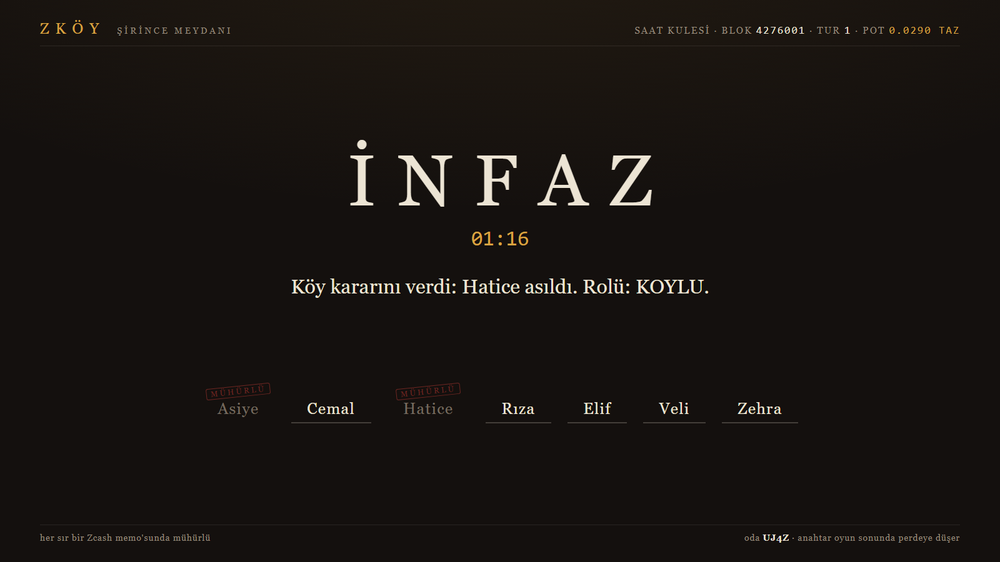
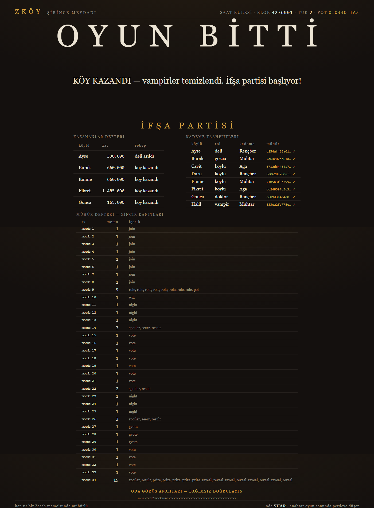

# ZKöy 🧛 — Vampir Köylü on Zcash

> **Sealed-ballot social deduction, played live on Zcash testnet.**
> Rol dağıtımından oylara, vasiyetlerden ödüllere — oyunun her sırrı bir
> Zcash şifreli memo'sunda mühürlenir; oyun sonunda odanın görüş anahtarı
> perdeye düşer ve herkes her şeyi kendi gözüyle doğrular.

**Rlay Blockchain Week Şirince · ZcashTR 48h Challenge (Ağustos 2026)**

<p align="center">
  
</p>

## Tez

Klasik Vampir Köylü, sır saklamayı EBEYE güvenerek çözer. ZKöy ebeyi **cam**
yapar: sırlar oyun boyunca zincirde kilitlidir, oyun sonunda anahtar herkese
verilir. Kontrat yok, devre yok — Zcash protokolünün kendisi yeter:

| Oyun mekaniği | Zcash primitifi |
|---|---|
| Rol kartı | oyuncunun cüzdanına **şifreli memo** |
| Oy / gece hamlesi / vasiyet | oda cüzdanına **mühürlü memo** (512B JSON — "Mühür protokolü") |
| Hayalet (ölüler her şeyi izler) | odanın **görüş anahtarı (UFVK)** |
| Pot ve ödüller | **shielded ödeme** — para + mesaj aynı işlemde |
| Gizli kademe (Ağalık) | `sha256(tier\|salt)` **taahhüdü** zincirde, oyun sonunda açılır |
| İfşa partisi | **anahtar teslimi** — kim kime, tur tur, herkes doğrular |

Prior-art: on-chain Mafia 2018'den beri var — ama **Zcash'te ilk**,
**kontratsız/memo-tabanlı her yerde ilk**, hayalet-viewing-key ve canlı-mekân
hibriti her yerde ilk.

## Nasıl oynanır

1. Perde projeksiyonda: salon, ekrandaki QR'ı telefon kamerasıyla okutur
   (uygulama tarayıcıda açılır — kurulum yok).
2. Kademeni seç (Rençber/Muhtar/Ağa — **kimseye görünmez**, oy ağırlığını ve
   pot payını belirler; karekök fiyatlama plütokrasi freni).
3. Gece telefonda oynanır, gündüz salonda tartışılır, oy mühürlü atılır.
4. Oyun bitince **ifşa partisi**: anahtar perdeye düşer, mühür defteri açılır.

<p align="center">
  
  
</p>

## Bağımsız doğrulama (cam ebe)

Oyun sonunda perdeye düşen UFVK ile herkes, hiçbir sunucuya güvenmeden tüm
oyunu okur:

```powershell
zingo-cli --chain testnet --server https://testnet.zec.rocks:443 `
  --data-dir <BOŞ-KLASÖR> --viewkey "<ODA-UFVK>" --birthday 4276100 `
  --waitsync messages
```

Çıktı: join'ler, gece hamleleri, oylar, vasiyetler, ödüller — ham JSON.
Kademe taahhütleri `sha256(tier|salt)` ile eşleşmek zorundadır; ebe sonradan
tek bir oy bile değiştiremez.

## Mimari

```
[Flutter web/PWA] ──HTTP poll──> [Bun sunucu]                    [Perde (tarayıcı)]
                                   ├─ Oda motoru (saf durum makinesi, 17 test)
                                   ├─ Mühür kuyruğu (batch + retry + self-heal)
                                   └─ zingo-cli (Rust) ──gRPC──> Zcash testnet (NU7/Ironwood)
```

- **Tempo sunucudan, kanıt zincirden**: oyun blok beklemez; zincir noter
  olarak saniyeler içinde arkadan yetişir (memo'lar mempool'dan okunur).
- Cüzdan izolasyonu: oda başına + oyuncu başına gerçek Zcash cüzdanı.
- Testnet'te mixnet transmit yapısal olarak kırık — zingo-cli'ye yazdığımız
  `network clearnet` yaması: [docs/zingo-patch.md](docs/zingo-patch.md)

## Çalıştırma

```bash
bun install
bun run dev                     # mock zincir — oyun zincirsiz de oynanır
ZKOY_CHAIN=zingo bun run dev    # gerçek testnet (yamalı zingo-cli gerekir)
bun test                        # motor testleri
```

Perde: `http://localhost:3131/screen/<ODA>` · Uygulama: `http://localhost:3131/app/`

## Belgeler

| Dosya | İçerik |
|---|---|
| [SPEC.md](SPEC.md) | Tek doğruluk kaynağı: kurallar, memo şeması, fazlar |
| [docs/API.md](docs/API.md) | İstemci sözleşmesi (birebir istek/cevap) |
| [docs/zingo-patch.md](docs/zingo-patch.md) | Testnet clearnet yaması + gerekçesi |
| [docs/DEMO.md](docs/DEMO.md) | Sahne günü runbook'u |

## Takım

- **Bekir Erdem** — backend, Zcash entegrasyonu, oyun motoru
- **Selinay Tiftikçi** — Flutter istemci, oyun ekranları

*Zcash 25 Ağustos'ta NU7 ile gizli oylamalı yönetişime geçiyor — ZKöy, aynı
fikrin bir köy meydanında oynanan hali.*
